# hash-stream-index-pipeline-server-poc

> An infra deployment PoC with an Indexing Pipeline for data at rest.

It enables data at rest to be served via a [`hash-stream` server](https://github.com/vasco-santos/hash-stream/tree/main) as content-addressable without being transformed. It deploys implementations from [`@hash-stream/index-pipeline`](https://github.com/vasco-santos/hash-stream/blob/main/packages/index-pipeline/README.md), in order to create indexes to enable a [`hash-stream` server](https://github.com/vasco-santos/hash-stream/tree/main) to serve this content in a content adressable fashion.

This repository contains deployment PoC for [hash-stream] Server implementing the [IPFS Trustless Gateway](https://specs.ipfs.tech/http-gateways/trustless-gateway/) built on a Node.js HTTP server with [Hono](https://hono.dev/). It makes it easy to bring a File System Store with data at rest into the content addressable world with minimal effort.

## Getting started

1. Install repository dependencies (`npm install`)
2. Run development server (`npx sst dev`)

## How it works

Once you have a server running, you will see in the console the HTTP endpoint for development purposes:

```sh
$ npm run dev -- --raw-content-store-path=./path-store

> hash-stream-index-pipeline-server-poc@1.0.0 dev
> node src/index.js --raw-content-store-path=./path-store

Listening on http://localhost:3000
Hash Stream Stores Path: /Users/vcs/.hash-stream-pipeline-server
Raw content Store Path: /Users/vcs/work/github/hash-stream-index-pipeline-server-poc/path-store
```

One can perform an HTTP Request to trigger the pipeline to run and create indexes for all the files in the given file system folder. Open another terminal and call the `sync` endpoint:

```sh
$ curl http://localhost:3000/sync | jq
[
  {
    "file": "IMG_8926.mov",
    "cid": "bafybeifetku6r5xurpvc56yk3wj3vr5r6t6hzlzkvgxzmbdqi7zv2xj24u"
  },
  {
    "file": "IMG_9528.mov",
    "cid": "bafybeiaxbrtsdhi4n2qv53wskm7s6dcr3wpxy7kqdcjp2tx2dafxeiqu2m"
  },
  {
    "file": "Screenshot 2025-03-12 at 08.56.29.png",
    "cid": "bafybeiaxpyk6fjzhfelde6ksf66neotwoeg24devtdl3ed3g7erosgg3qy"
  }
]
```

And the following output should appear on the server:

```sh
Scheduled file: IMG_8926.mov
IMG_8926.mov was indexed with CID: bafybeifetku6r5xurpvc56yk3wj3vr5r6t6hzlzkvgxzmbdqi7zv2xj24u

Scheduled file: IMG_9528.mov
IMG_9528.mov was indexed with CID: bafybeiaxbrtsdhi4n2qv53wskm7s6dcr3wpxy7kqdcjp2tx2dafxeiqu2m

Scheduled file: Screenshot 2025-03-12 at 08.56.29.png
Screenshot 2025-03-12 at 08.56.29.png was indexed with CID: bafybeiaxpyk6fjzhfelde6ksf66neotwoeg24devtdl3ed3g7erosgg3qy
```

From here, it is possible for Hashstream server running to serve the index content.

### Fetch content addressable data from server

#### with curl

```sh
curl http://localhost:3000/ipfs/bafybeiaxpyk6fjzhfelde6ksf66neotwoeg24devtdl3ed3g7erosgg3qy\?format\=car --output bafybeiaxpyk6fjzhfelde6ksf66neotwoeg24devtdl3ed3g7erosgg3qy.car 
```

One can then rely on `ipfs-car` CLI to unpack the file and compare it with the original file. When using `ipfs-car unpack` the content is also verified to guarantee it matches the exact CID.

#### with `@helia/verified-fetch`

```js
import fs from "fs";
import { createVerifiedFetch } from "@helia/verified-fetch";
import { CID } from "multiformats/cid";

const serverUrl =
  "http://localhost:3000";
const cidString = "bafybeiaxpyk6fjzhfelde6ksf66neotwoeg24devtdl3ed3g7erosgg3qy";

async function main() {
  const cid = CID.parse(cidString);
  
  console.log("Fetching all content via verified fetch...");
  const verifiedFetch = await createVerifiedFetch({
    gateways: [serverUrl],
  });

  const response = await verifiedFetch(`ipfs://${cid}/`);
  console.log("response", response.status);
  const body = await response.arrayBuffer();
  const bodyBytes = new Uint8Array(body);

  // Write to disk
  await fs.promises.writeFile(
    `./${cid.toString()}`,
    Buffer.from(bodyBytes)
  );

  await verifiedFetch.stop();
}
```

## 🧩 Index Pipeline Architecture

The following architecture outlines a pipeline to generate indexes from files stored in a file store. The pipeline lists raw files, schedules them for indexing, and a file processer generates detached indexes that map content to byte ranges.

> Note: When using UnixFS, a root block must be created and stored separately. This enables clients to reconstruct the UnixFS DAG when requesting the root CID, while still allowing retrieval by individual leaf CIDs.



### ☁️ Hash Stream Server Architecture after running pipeline

When working with detached indexes (specially UnixFS) and raw files, the Hash Stream server needs access to both the file storage and the stored root blocks.

The "default" implementation of the HashStream Server uses a `PackReader`, which only has access to the Pack Store. In this case the HashStream server not only needs to access the PackStore where the UnixFS Root blocks get stored, but also the FileStore where the raw files are stored. Therefore, a `UnixFsPackReader` building block is also provided to facilitate this.

The following diagram illustrates a potential architecture for a Hash Stream Server. It reads paths from the indexes via the `FileStore` and multihashes for the UnixFS Root Block via the `PackStore`. This enables an ingestion pipeline to be Content Addressable and directly to the PackStore underlying storage if desired.



## From PoC to Production insights

### Scheduler

This PoC currently relies on an HTTP endpoint to trigger the pipeline for processing a given file system folder (`HTTP GET /sync`). It keeps the queue in memory for indexing all the files in the folder. This should be improved for a more production ready queue implementation.

### Streamer server

For convenience in this PoC it is also deployed a Hashstream server in the `/ipfs/CID` route. This is for demo/test cases, and does not need to be deployed at all in the same infrastructure repo as this pipeline.

